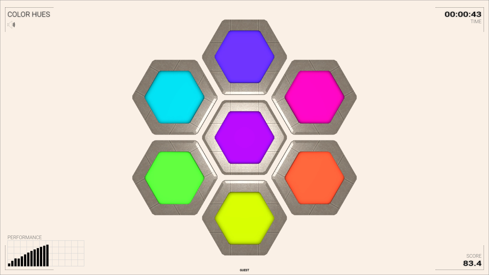
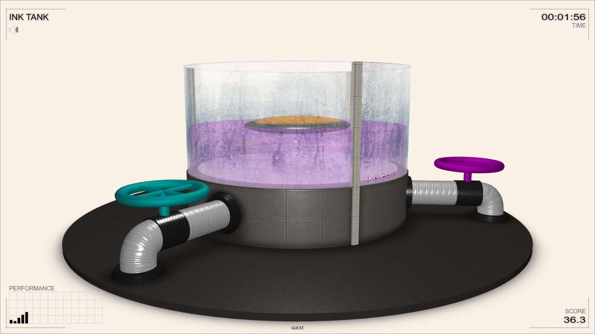
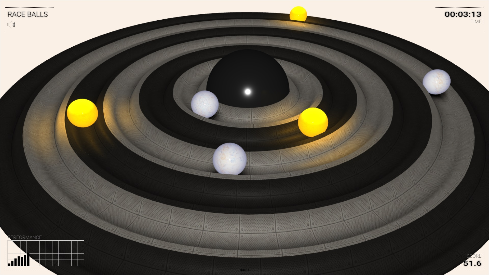
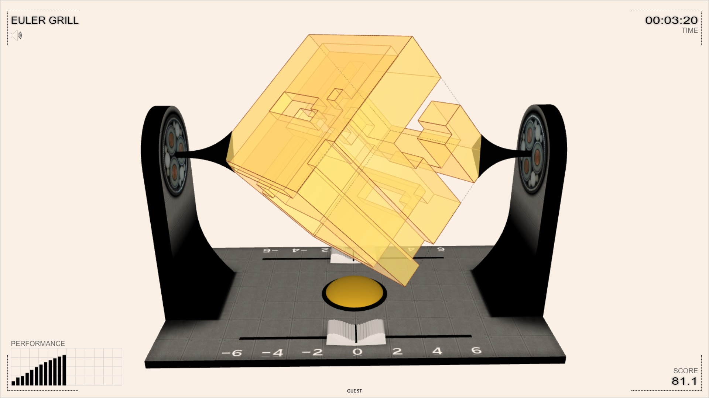
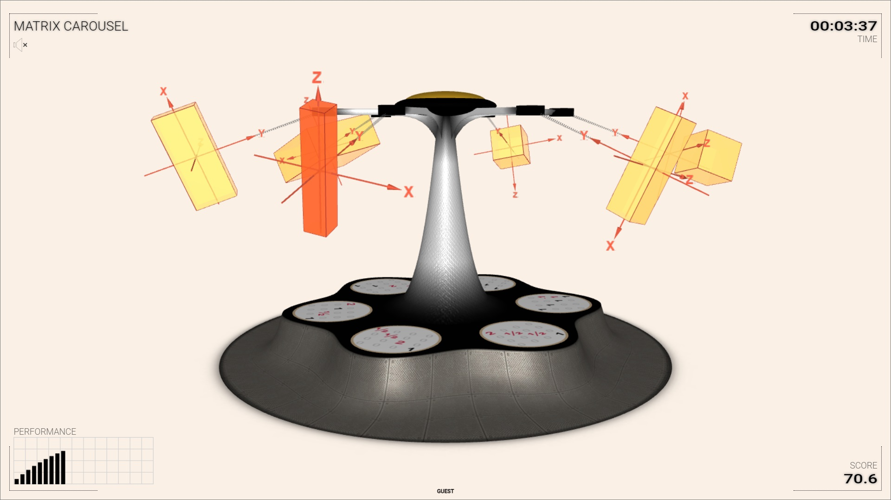
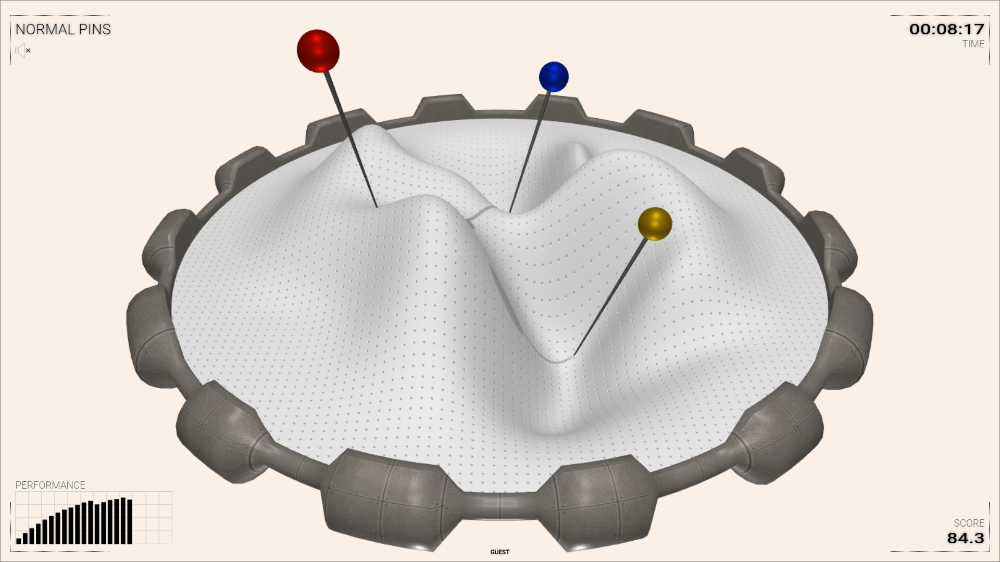
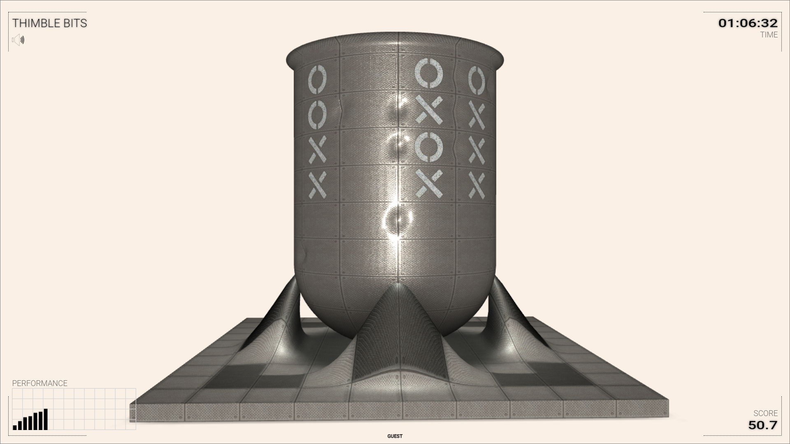
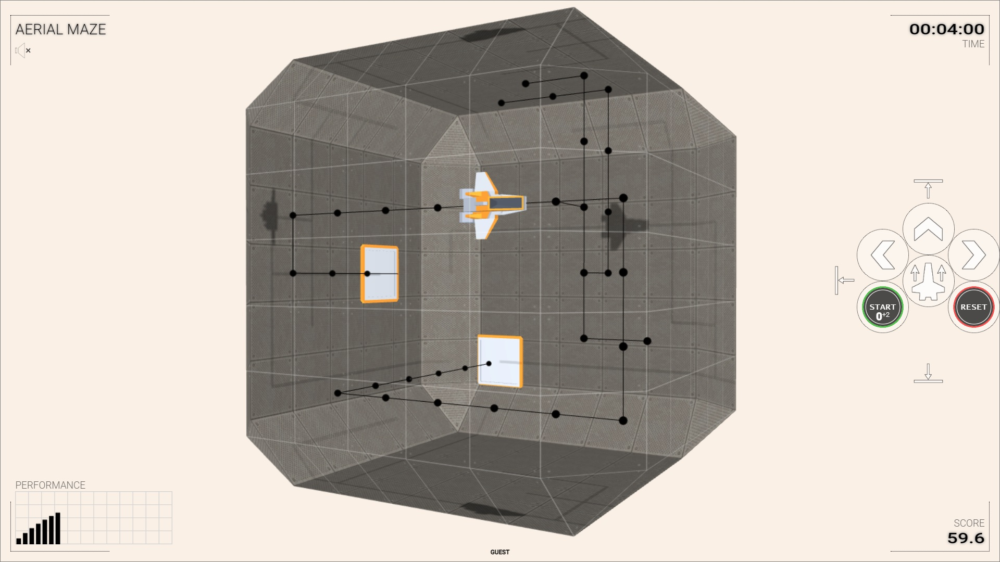
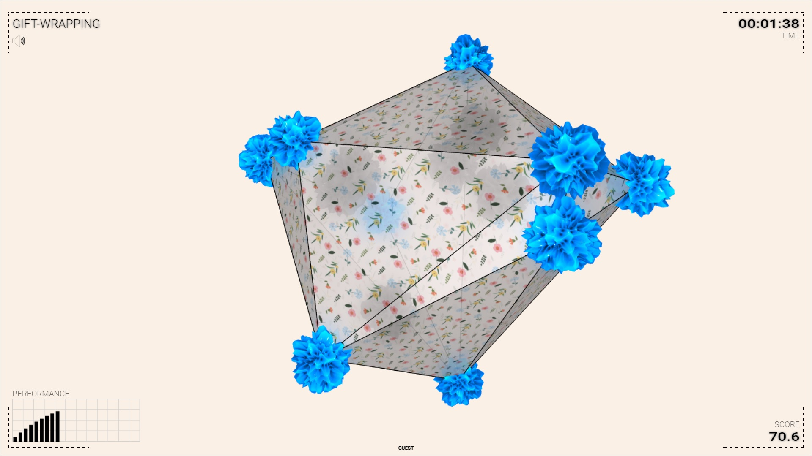

&nbsp;
# Suica SCORM

<!-- “Patience is not the ability to wait, but the ability to keep a good attitude while waiting.”-->

## LMS info

This SCO is used for experiments with SCORM 1.2-complient LMS. It shows the list of elements passed from the LMS to the SCORM. The elements that are read-write can be modified and sent back to the LMS.

## Color hues

 This is the first (in the world) SCO that uses [Suica](https://boytchev.github.io/suica/) and [Three.js](https://threejs.org/). The challenge is to find which two of six colors have hues closest to the hue of a randomly generated color.

[ <!-- markdown-link-check-disable -->[More info](src/color-hues/index.html)<!-- markdown-link-check-enable --> ] [ [Run online](src/color-hues/color-hues.html) ] [ [Download](bin/color-hues.zip) ]

## Ink tank

 The challenge is to construct color by mixing cyan, magenta and yellow ink. This is done by filling a tank with colored liquids.

[ <!-- markdown-link-check-disable -->[More info](src/ink-tank/index.html)<!-- markdown-link-check-enable --> ] [ [Run online](src/ink-tank/ink-tank.html) ] [ [Download](bin/ink-tank.zip) ]

## Race balls

 Several balls are rolling on circular tracks. Pick the two balls &ndash; the one with highest and the one with lowest angular speed.

[ <!-- markdown-link-check-disable -->[More info](src/race-balls/index.html)<!-- markdown-link-check-enable --> ] [ [Run online](src/race-balls/race-balls.html) ] [ [Download](bin/race-balls.zip) ]

## Euler grill

 A polyhedron is spinning on a grill. Calculate the value of the Euler characteristic by counting vertices, edges, faces ... or only tunnels.

[ <!-- markdown-link-check-disable -->[More info](src/euler-grill/index.html)<!-- markdown-link-check-enable --> ] [ [Run online](src/euler-grill/euler-grill.html) ] [ [Download](bin/euler-grill.zip) ]

## Matrix carousel

 Graphical transformations are riding a swing carousel. Spin the carousel so that each transformation matches its matrix.

[ <!-- markdown-link-check-disable -->[More info](src/matrix-carousel/index.html)<!-- markdown-link-check-enable --> ] [ [Run online](src/matrix-carousel/matrix-carousel.html) ] [ [Download](bin/matrix-carousel.zip) ]

## Normal pins

 Arrange a set of pins on a pincushion so that they are as close to the normal vectors (at the pinpoints) as it is reasonably possible.

[ <!-- markdown-link-check-disable -->[More info](src/normal-pins/index.html)<!-- markdown-link-check-enable --> ] [ [Run online](src/normal-pins/normal-pins.html) ] [ [Download](bin/normal-pins.zip) ]

## Thimble bits

 Knowing at least one bitmask of a zone inside a thimble, set the bitmask of another zone by using the Cohen-Sutherland line splitting algorithm.

[ <!-- markdown-link-check-disable -->[More info](src/thimble-bits/index.html)<!-- markdown-link-check-enable --> ] [ [Run online](src/thimble-bits/thimble-bits.html) ] [ [Download](bin/thimble-bits.zip) ]

## Aerial maze

 Controlling a spaceship to fly from one position in space to another using a limited set of commands to manage yaw, pitch and roll.

[ <!-- markdown-link-check-disable -->[More info](src/aerial-maze/index.html)<!-- markdown-link-check-enable --> ] [ [Run online](src/aerial-maze/aerial-maze.html) ] [ [Download](bin/aerial-maze.zip) ]

## Gift-wrapping (under construction)

 Picking points from a cloud of point to define how to gift-wrap the whole cloud. These points must form the vertices of a convex hull.

[ <!-- markdown-link-check-disable -->[More info](src/gift-wrapping/index.html)<!-- markdown-link-check-enable --> ] [ [Run online](src/gift-wrapping/gift-wrapping.html) ] [ [Download](bin/gift-wrapping.zip) ]

<small>{{site.time | date: "%B, %Y"}}</small>