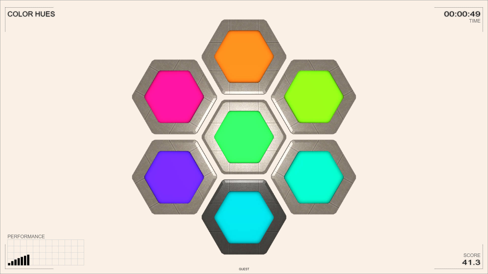

# Suica SCORM

> “Patience is not the ability to wait, but the ability to keep a good attitude while waiting.”

This repository and its documentation are currently under construction. Be patient, please. The first version should be ready by the end of June 2022.

## LMS Info

This SCO is used for experiments with SCORM 1.2-complient LMS. It shows the list of elements passed from the LMS to the SCORM. The elements that are read-write can be modified and sent back to the LMS.

## Color hues

 This is the first (in the world) SCO that uses [Suica](https://boytchev.github.io/suica/) and [Three.js](https://threejs.org/). It is used to evaluate how well a user distinguishes color hues.

[ [More info](src/color-hues/index.html) ] [ [Run online](src/color-hues/color-hues.html) ] [ [Download](bin/color-hues.zip) ]

<small>{{site.time | date: "%B, %Y"}}</small>