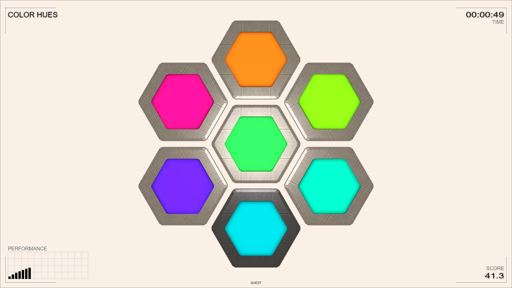

# Color Hues

[Hue](https://en.wikipedia.org/wiki/Hue) is the main property of a color. It defines the color tone, like red, green or blue. This application shows colors with different hues and the user must fit a hue among other hues.

Click on the image to start the application.

Alternatively, here are versions in [English](color-hues.html?lang=en), [Bulgarian](color-hues.html?lang=bg) or [Japanese](color-hues.html?lang=jp).

### How to play

When the application is started it shows the back sides of seven hexagonal plates. Click on any of them to flip all of them and see randomly generated colors &ndash; the six outer plates show colors with successive hues; while the central plate shows another hue. The challenge is to fit the central hue between two of the outer hues. And this must be done on a sequence of challenges with increasing difficulty. The ultimate goal is to reach score 100.

Selection of hues is done by clicking on outer plates. If needed, a second click unselects a plate. When the two plates are selected, clicking on the central plate finalizes the attempt.

The next image shows two cases with arrows pointing to the plates with closest hues to the central plate. If the hues are lined up, the central hue fits just between the two selected hues. As the score progresses, the challenge becomes harder &ndash; generated hues get closer to each other.

### Integration with LMS

This application is provided as [SCORM](https://scorm.com/scorm-explained/one-minute-scorm-overview/) (Sharable Content Object Reference Model) module. It can be used with any [LMS](https://en.wikipedia.org/wiki/Learning_management_system) (Learning Management System) that supports version SCORM 1.2. SCORM modules are delivered as ZIP archive.

[ [Download ZIP](../bin/color-hues.zip) ]

Follow the instruction of your LMS on how to install a SCORM module. Usually the ZIP is uploaded and a few additional settings are set.

When run from a LMS, the application reads these data:
- `cmi.core.student_name` &ndash; a string with the student's name

When run from a LMS, the application sends back these data:

- `cmi.core.score.raw` &ndash; a floating-point number from 0 to 100 for the final score
- `cmi.core.score.max` &ndash; always 100
- `cmi.core.score.min` &ndash; always 0
- `cmi.core.lesson_status` &ndash; either `'completed'` if at least one challenge is opened; or `'browsed'` otherwise

### Perception of hue

The perception of hue varies among people, but also, it varies within the same person. There are many factors that influence the precision of hue perception.

- **Biological**: people with [color vision deficiency](https://en.wikipedia.org/wiki/Color_blindness) may have issues distinguishing hues. 
- **Environmental**: lighting conditions like [color temperature](https://en.wikipedia.org/wiki/Color_temperature) and intensity may affect hue perception.
- **Technological**: capabilities of devices, their [color gamut](https://en.wikipedia.org/wiki/Gamut) and callibration change how color are seen.
- **Psychological**: emotional state is known to affect human perceptions, including color perception.

### Disclaimer

Although the application may suggest clues of color deficiencies, it is not a diagnostic tool and should not be used for medical examination. A low sensitivity to some hues is not a definitive indicator of color deficiency, as there are many factors that change the perception of hue.

	
<small>{{site.time | date: "%B, %Y"}}</small>