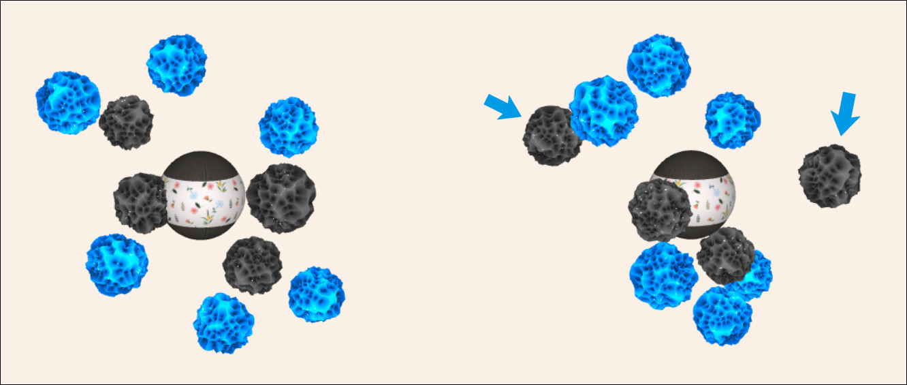

&nbsp;
# Gift-wrapping

<!--
There are different ways to construct a color. When using dyes and inks the most common way to represent a color is as a combination of different proportions of *cyan*, *magenta* and *yellow* inks. This is the so called [CMY color model](https://en.wikipedia.org/wiki/CMY_color_model). CMY color model is subtractive model &ndash; each ink absorbs (subtracts) part of the light. When all inks are used together, they absorb the full spectrum and the result is a black color.

The **Ink tank** application allows experimenting with mixing inks. This is similar to how painters mix colors on their palette. For example, yellow and cyan inks produce green color; while yellow and red &ndash; orange.

Click on the image to start the application.

Alternatively, here are versions in [English](ink-tank.html?lang=en), [Bulgarian](ink-tank.html?lang=bg) and [Japanese](ink-tank.html?lang=jp).

### How to play

When the application is started it shows an empty tank and three tubes. Inside the tank there is a plate which color must be recreated as a mixture of cyan, magenta and yellow inks. This must be done on a sequence of challenges with increasing difficulties. The ultimate goal is to reach score 100. 

- **Starting**: Click anywhere on the tank.
- **Playing**:  Press and hold on a tube to add more ink. Do this until the tank is full to the top and the tank ink color matches the plate color.
- **Ending**: Click on the plate to end the challenge.

Here are a few hints: The tubes can be activated as many times as it is needed. Some complex colors are difficult to create at once. A challenge can be ended only when the tank is full to the top, otherwise clicking on the plate has no effect. Higher difficulties use more complex colors and require higher precision of color matching. Sometimes it is easier to spot the difference between two colors by looking from the side or from the top. In the next image, for example, the side view reveals better the difference (the ink is slightly bluish compared to the plate).

-->

### Integration with LMS

This application is provided as [SCORM](https://scorm.com/scorm-explained/one-minute-scorm-overview/) (Sharable Content Object Reference Model) module. It can be used with any [LMS](https://en.wikipedia.org/wiki/Learning_management_system) (Learning Management System) that supports version SCORM 1.2. SCORM modules are delivered as ZIP archive.

[ [Download ZIP](../../bin/ink-tank.zip) ]

Follow the instruction of your LMS on how to install a SCORM module. Usually the ZIP is uploaded and a few additional settings are set.

When run from a LMS, the application reads these data:
- `cmi.core.student_name` &ndash; a string with the student's name

When run from a LMS, the application sends back these data:

- `cmi.core.score.raw` &ndash; a number from 0 to 100 for the overall score
- `cmi.core.score.min` &ndash; 0
- `cmi.core.score.max` &ndash; 100
- `cmi.core.lesson_status` &ndash; `'completed'` or `'incomplete'`

### Data policy

The application itself does not create or use [HTTP cookies](https://developer.mozilla.org/en-US/docs/Web/HTTP/Cookies), [web beacons](https://en.wikipedia.org/wiki/Web_beacon), [spy pixels](https://en.wikipedia.org/wiki/Spy_pixel) or any other tracking technology. Besides SCORM-related data, described in section [Integration with LMS](#integration-with-lms), the application creates a local storage entry called `'sound'` with values `'on'`, `'off'` or `'fx'`. This entry is used to record user's sound preference and it is not sent to the server.

When the application is run from a LMS, the LMS may utilize its own data policy, which is beyond the scope and the control of this application.
<!--
### Disclaimer

This application is not appropriate to users with color deficiencies. Emotional state, environment and screen calibration may impact the color perception.
-->
### Credits

This application uses a texture from [Vecteezy](https://www.vecteezy.com):

- "[Seamless hand drawn pastel floral pattern background](https://www.vecteezy.com/vector-art/3415856-seamless-hand-drawn-pastel-floral-pattern-background)" by [Kachaya Thawansak](https://www.vecteezy.com/members/wawa99),

<!--and a background music from [SoundCloud](https://soundcloud.com):

- "[Calmness](https://soundcloud.com/ashamaluevmusic/calmness)" by Aleksandr Shamaluev / AShamaluevMusic, [https://www.ashamaluevmusic.com](https://www.ashamaluevmusic.com),
-->
and sound effects from [Mixkit](https://mixkit.co/):

- "[Game quick warning notification](https://mixkit.co/free-sound-effects/click/)" licensed under [Mixkit Sound Effects Free License](https://mixkit.co/license/#sfxFree),
- "[Quick win video game notification](https://mixkit.co/free-sound-effects/click/)" licensed under [Mixkit Sound Effects Free License](https://mixkit.co/license/#sfxFree).

	
<small>{{site.time | date: "%B, %Y"}}</small>