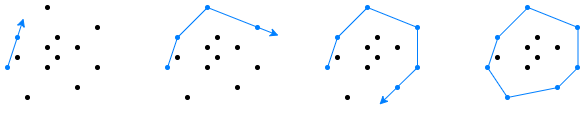

&nbsp;
### About

A [convex hull](https://en.wikipedia.org/wiki/Convex_hull) is the smallest shape that envelops a set of points in space. They are important in 3D modelling, because some computer graphics algorithms benefit from objects being convex. The following image shows a concave 3D object and its convex hull.

One of the basic algorithms for finding the convex hull of points in the plane is called [gift-wrapping algorithm](https://en.wikipedia.org/wiki/Gift_wrapping_algorithm). Visually it resembles the wrapping of gifts. When the points are in a plane, they are wrapped in a polygon. Points in 3D, however, are wrapped in a [convex polyhedron](https://en.wikipedia.org/wiki/Convex_polytope).

The **Gift-wrapping** application allows the players to train and test their sense of 3D shapes by wrapping a cloud of points.

Click on the image to start the application.

Alternatively, here are versions in [English](gift-wrapping.html?lang=en), [Bulgarian](gift-wrapping.html?lang=bg) and [Japanese](gift-wrapping.html?lang=jp).

### How to play

When the application is started it shows a ball. Click on the ball to show a cloud of gray objects. Then pick only those of them, that are at the vertices of the convex hull enclosing all objects. This must be done on a sequence of challenges with increasing number of objects. The ultimate goal is to reach score 100. 

- **Starting**: Click on the ball or on a wrapped gift.
- **Playing**: Click on the objects to select or unselect them. Selected objects are blue, the unselected objects are dark gray. Double-click on an object to toggle all objects.
- **Ending**: Click on the ball to end the challenge.

Here are a few hints: It is possible to use a 2D convex hull to resolve a 3D convex hull. The most "external" objects define vertices of the convex hull. These objects are easy to spot as they define the boundary of the shape. However, some objects are harder to identify, unless the scene is rotated in such a way, that they become on the boundary. Consider the image below. The left snapshot shows 6 selected (blue) objects that belong to the convex hull. The other 4 unselected (gray) objects are questionable. When the scene is slightly rotated, two of the gray objects can be identified as part of the convex hull too, and two still remain questionable.

### Integration with LMS

This application is provided as [SCORM](https://scorm.com/scorm-explained/one-minute-scorm-overview/) (Sharable Content Object Reference Model) module. It can be used with any [LMS](https://en.wikipedia.org/wiki/Learning_management_system) (Learning Management System) that supports version SCORM 1.2. SCORM modules are delivered as ZIP archive.

<!--
[ [Download ZIP](../../bin/gift-wrapping.zip) ]
-->

Follow the instruction of your LMS on how to install a SCORM module. Usually the ZIP is uploaded and a few additional settings are set.

When run from a LMS, the application reads these data:
- `cmi.core.student_name` &ndash; a string with the student's name

When run from a LMS, the application sends back these data:

- `cmi.core.score.raw` &ndash; a number from 0 to 100 for the overall score
- `cmi.core.score.min` &ndash; 0
- `cmi.core.score.max` &ndash; 100
- `cmi.core.lesson_status` &ndash; `'completed'` or `'incomplete'`

### Data policy

The application itself does not create or use [HTTP cookies](https://developer.mozilla.org/en-US/docs/Web/HTTP/Cookies), [web beacons](https://en.wikipedia.org/wiki/Web_beacon), [spy pixels](https://en.wikipedia.org/wiki/Spy_pixel) or any other tracking technology. Besides SCORM-related data, described in section [Integration with LMS](#integration-with-lms), the application creates a local storage entry called `'sound'` with values `'on'`, `'off'` or `'fx'`. This entry is used to record user's sound preference and it is not sent to the server.

When the application is run from a LMS, the LMS may utilize its own data policy, which is beyond the scope and the control of this application.

### Disclaimer

This application requires a good sense of 3D shapes &ndash; depth of objects, relative position of one object in respect to other objects, and mental reconstruction of 3D shapes by their vertices.

### Credits

This application uses a texture from [Vecteezy](https://www.vecteezy.com):

- "[Seamless hand drawn pastel floral pattern background](https://www.vecteezy.com/vector-art/3415856-seamless-hand-drawn-pastel-floral-pattern-background)" by [Kachaya Thawansak](https://www.vecteezy.com/members/wawa99),

a background music from [SoundCloud](https://soundcloud.com):

- "[The Holiday Season](https://soundcloud.com/pablo-de-pacas/the-holiday-season)" by [Pablo De Pacas](https://soundcloud.com/pablo-de-pacas) licensed under [CC-BY-3.0 license](https://creativecommons.org/licenses/by/3.0/),

and sound effects from [Mixkit](https://mixkit.co/):

- "[Game quick warning notification](https://mixkit.co/free-sound-effects/click/)" licensed under [Mixkit Sound Effects Free License](https://mixkit.co/license/#sfxFree),
- "[Quick win video game notification](https://mixkit.co/free-sound-effects/click/)" licensed under [Mixkit Sound Effects Free License](https://mixkit.co/license/#sfxFree),
- "[Pen click and release](https://mixkit.co/free-sound-effects/click/)" licensed under [Mixkit Sound Effects Free License](https://mixkit.co/license/#sfxFree).

	
<small>{{site.time | date: "%B, %Y"}}</small>