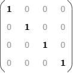
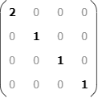
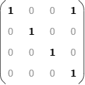
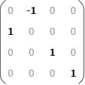
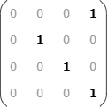
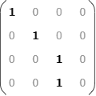
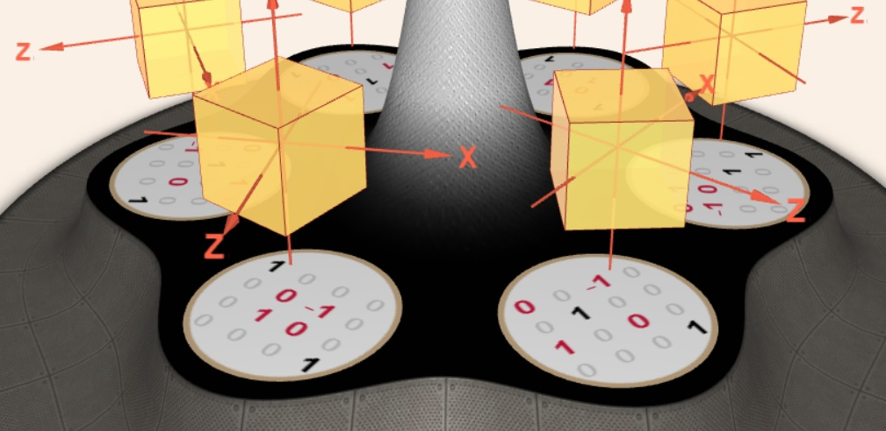

&nbsp;
### About

The [swing carousel](https://en.wikipedia.org/wiki/Swing_ride) is an amusement ride with seats hanging from a spinning top. This application features a carousel with geometrical transformations and matrices. The basic geometrical transformations can be represented with [transformation matrices](https://en.wikipedia.org/wiki/Transformation_matrix). 

Click on the image to start the application.

Alternatively, here are versions in [English](matrix-carousel.html?lang=en), [Bulgarian](matrix-carousel.html?lang=bg) and [Japanese](matrix-carousel.html?lang=jp).

Examples of transformation matrices:

| Matrix  | Transformation | Description |
| ------- | :------------: | ----------- |
|  | Identity | The identity transformation matrix keeps the geometrical object the same: (*x*,*y*,*z*)→(*x*,*y*,*z*) |
|  | Scaling | The scaling transformation matrix scales the geometrical object. The example matrix expands the object twice along its X axis: (*x*,*y*,*z*)→(2*x*,*y*,*z*) |
|  | Translation | The translation transformation matrix translates the geometrical object. The example matrix moves the object 1 unit along its X axis: (*x*,*y*,*z*)→(*x*+1,*y*,*z*) |
|  | Rotation | The rotation transformation matrix rotates the geometrical object around one of its axes. The example shown here is for rotation of 90&deg; around the object's Z axis: (*x*,*y*,*z*)→(-*y*,*x*,*z*) |
|  | Orthographic projection | The orthographic projection matrix projects the geometrical object onto a plane. The distance to the plane does not affect the projection. The example shown here is for orthographic projection to plane at *x*=1 and perpendicular to object's X axis: (*x*,*y*,*z*)→(1,*y*,*z*) |
|  | Perspective projection | The perspective projection matrix projects the geometrical object onto a plane. The distance to the plane affects the projection. The example shown here is for perspective projection to plane at *x*=1 and perpendicular to object's X axis: (*x*,*y*,*z*)→(1,*y*/*x*,*z*/*x*) |

### How to play

When the application is started it shows an empty carousel. When a challenge is started the carousel has cubes instead of seats. Every cube is animated according to some geometrical transformation. Below the cubes there are matrices. The carousel must be rotated and stopped so that cubes are right above their corresponding matrices. The level of difficulty determines how complex the transformation is and how many fake matrices are used. The goal is to reach score 100. 

- **Starting**: Click anywhere on the carousel.
- **Playing**:  Press on a cube and hold the pointer to continuously spin the carousel. If you need to spin the carousel just one step at a time, click on a cube. 
- **Ending**: Click on the big button on the top of the carousel to end the challenge.

Here are a few hints: Pick the matrix (or transformation) that is easiest to you and spin the carousel until it is matched. Then check the rest of the matrices. If there are several instances of the same transformation, make sure you pair well each transformation to its matrix. Beware of fake matrices &ndash; there are matrices for which there is no transformation on the carousel. Sometimes it is faster to map the type of the matrix, i.e. translation vs translation and rotation vs rotation, and afterwards to verify whether the axes are paired too.

The following example demonstrates two rotation transformations around Y axes above two rotation matrices. The left pair is wrong, because the matrix corresponds to rotation around the X axis. The right pair is correct as its both rotations are aroud the Y axes and they are in the same direction (note: direction of cube rotation is not shown in the snapshot).
 
 

### Integration with LMS

This application is provided as [SCORM](https://scorm.com/scorm-explained/one-minute-scorm-overview/) (Sharable Content Object Reference Model) module. It can be used with any [LMS](https://en.wikipedia.org/wiki/Learning_management_system) (Learning Management System) that supports version SCORM 1.2. SCORM modules are delivered as ZIP archive.

[ [Download ZIP](../../bin/matrix-carousel.zip) ]

Follow the instruction of your LMS on how to install a SCORM module. Usually the ZIP is uploaded and a few additional settings are set.

When run from a LMS, the application reads these data:
- `cmi.core.student_name` &ndash; a string with the student's name

When run from a LMS, the application sends back these data:

- `cmi.core.score.raw` &ndash; a number from 0 to 100 for the overall score
- `cmi.core.score.min` &ndash; 0
- `cmi.core.score.max` &ndash; 100
- `cmi.core.lesson_status` &ndash; `'completed'` or `'incomplete'`

### Data policy

The application itself does not create or use [HTTP cookies](https://developer.mozilla.org/en-US/docs/Web/HTTP/Cookies), [web beacons](https://en.wikipedia.org/wiki/Web_beacon), [spy pixels](https://en.wikipedia.org/wiki/Spy_pixel) or any other tracking technology. Besides SCORM-related data, described in section [Integration with LMS](#integration-with-lms), the application creates a local storage entry called `'sound'` with values `'on'`, `'off'` or `'fx'`. This entry is used to record user's sound preference and it is not sent to the server.

When the application is run from a LMS, the LMS may utilize its own data policy, which is beyond the scope and the control of this application.

### Disclaimer

The matrices represented in the application do not correspond literally to the animated geometrical transformations. For example, rotation is shown as gradual rotation of 90&deg;, while its matrix rotates at 90&deg; in a single step.

### Credits

This application uses a background soundscape from [FreeSound](https://freesound.org):

- "[Fairground Ambience](https://freesound.org/people/HECKFRICKER/sounds/635159/)" by [HECKFRICKER](https://freesound.org/people/HECKFRICKER/) licensed under [CC 0 License](http://creativecommons.org/publicdomain/zero/1.0/),

sound effects from [FreeSound](https://freesound.org):

- "[Carousel Brighton](https://freesound.org/people/OneTwo_BER/sounds/474195/)" by [OneTwo_BER](https://freesound.org/people/OneTwo_BER/) licensed under [CC 0 License](http://creativecommons.org/publicdomain/zero/1.0/),
- "[Swing](https://freesound.org/people/karlis.stigis/sounds/168640/)" by [karlis.stigis](https://freesound.org/people/karlis.stigis/) licensed under [CC 0 License](http://creativecommons.org/publicdomain/zero/1.0/),

and from [Mixkit](https://mixkit.co/):

- "[Game quick warning notification](https://mixkit.co/free-sound-effects/click/)" licensed under [Mixkit Sound Effects Free License](https://mixkit.co/license/#sfxFree),
- "[Quick win video game notification](https://mixkit.co/free-sound-effects/click/)" licensed under [Mixkit Sound Effects Free License](https://mixkit.co/license/#sfxFree).

	
<small>{{site.time | date: "%B, %Y"}}</small>