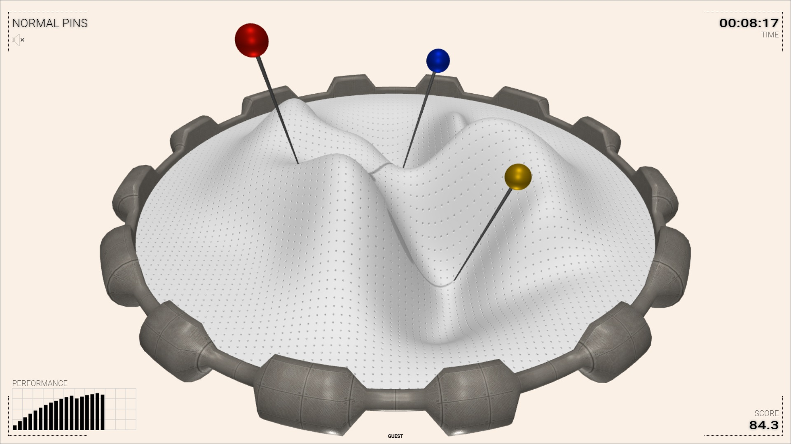

&nbsp;
# Normal Pins

[Normal vectors](https://mathworld.wolfram.com/NormalVector.html) serve an important role in Mathematics and Computer Graphics. When a normal vector is constructed on a point on a surface, this vector is perpendicular to the surface around this point. This application shows pins that must be put on a [pincushion](https://en.wikipedia.org/wiki/Pincushion). The positions of the pins are fixed, but their orientations can be manipulated. All pins come in pairs &ndash; one pin is against its mate pin.

Click on the image to start the application.

Alternatively, here are versions in [English](normal-pins.html?lang=en), [Bulgarian](normal-pins.html?lang=bg) and [Japanese](normal-pins.html?lang=jp).

### How to play

When the application is started it shows a pincushion with a pair of pins. The pin can be rotated around the pinpoint so that it becomes perpendicular to the surface, i.e. it is its normal vector. There are two types of pincushions &ndash; a bright matte one and a dark shiny one. The level of difficulty defines the color of the pincushion, the number of pins (from 1 to 4) and how precise they should be rotated. The goal is to reach score 100. 

- **Starting**: Click anywhere on the pincushion.
- **Playing**:  Drag the head of a pin to rotate it. Its mate pin will rotate automatically.
- **Ending**: Click on the outer rim to end the challenge.

Here are a few hints: It is sufficient to make the pin look perpendicular from two different directions (optimally they should be perpendicular). The dot pattern on a bright pincushion can be used to guess the [tangent vectors](https://en.wikipedia.org/wiki/Tangent_vector). When the pincushion is dark the shiny reflections may be used as hint to the correct orientation of the normal vectors. When one pins in a pair is normal vector, then the mate pin is also a normal vector. Sometimes one of the pins in a pair is easier to do than the other pin.

The following snapshots show: a pair of opposite pins, using surface profile as a guide for the normal vector and using the dot pattern as a guide.

### Integration with LMS

This application is provided as [SCORM](https://scorm.com/scorm-explained/one-minute-scorm-overview/) (Sharable Content Object Reference Model) module. It can be used with any [LMS](https://en.wikipedia.org/wiki/Learning_management_system) (Learning Management System) that supports version SCORM 1.2. SCORM modules are delivered as ZIP archive.

[ [Download ZIP](../../bin/euler-grill.zip) ]

Follow the instruction of your LMS on how to install a SCORM module. Usually the ZIP is uploaded and a few additional settings are set.

When run from a LMS, the application reads these data:
- `cmi.core.student_name` &ndash; a string with the student's name

When run from a LMS, the application sends back these data:

- `cmi.core.score.raw` &ndash; a number from 0 to 100 for the overall score
- `cmi.core.score.min` &ndash; 0
- `cmi.core.score.max` &ndash; 100
- `cmi.core.lesson_status` &ndash; `'completed'` or `'incomplete'`

### Data policy

The application itself does not create or use [HTTP cookies](https://developer.mozilla.org/en-US/docs/Web/HTTP/Cookies), [web beacons](https://en.wikipedia.org/wiki/Web_beacon), [spy pixels](https://en.wikipedia.org/wiki/Spy_pixel) or any other tracking technology. Besides SCORM-related data, described in section [Integration with LMS](#integration-with-lms), the application creates a local storage entry called `'sound'` with values `'on'`, `'off'` or `'fx'`. This entry is used to record user's sound preference and it is not sent to the server.

When the application is run from a LMS, the LMS may utilize its own data policy, which is beyond the scope and the control of this application.

### Disclaimer

The application uses relatively small interactive elements. It might be easier to manipulate them with a precise pointing device.

### Credits

This application uses a background music from [SoundCloud](https://soundcloud.com):

- "[Might & Magic](https://soundcloud.com/serpentsoundstudios/might-magic)" by [Alexander Nakarada](www.serpentsoundstudios.com) licensed under [CC BY 4.0 License](https://creativecommons.org/licenses/by/4.0/),

and sound effects from [Mixkit](https://mixkit.co/):

- "[Game quick warning notification](https://mixkit.co/free-sound-effects/click/)" licensed under [Mixkit Sound Effects Free License](https://mixkit.co/license/#sfxFree),
- "[Quick win video game notification](https://mixkit.co/free-sound-effects/click/)" licensed under [Mixkit Sound Effects Free License](https://mixkit.co/license/#sfxFree).

	
<small>{{site.time | date: "%B, %Y"}}</small>