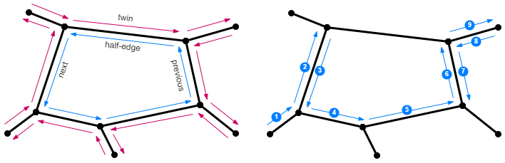

&nbsp;
# Platonic walk

Many computer graphics algorithms use a special data structure to represent and work with polyhedra &ndash; [Doubly Connected Edge List (DCEL)](https://en.wikipedia.org/wiki/Doubly_connected_edge_list). This structure represents each edge as two half-edges with opposite directions.  

Click on the image to start the application.

Alternatively, here are versions in [English](platonic-walk.html?lang=en), [Bulgarian](platonic-walk.html?lang=bg) and [Japanese](platonic-walk.html?lang=jp).

Orientations of all half-edges forming one face of the 3D body is consistent throughout all faces of the body. Typically, when an object is observed from outside, all half-edges form loops in counterclockwise direction as the default [positive direction in Mathematics](https://en.wikipedia.org/wiki/Clockwise#Mathematics). For each **half-edge** the DCEL provides function to get the **next half-edge** from the loop, the **previous half-edge** from the loop and the corresponding **twin half-edge**.

The traversal of a DCEL mesh uses these functions. For example, the path from half-edge (1) to half-edge (9) is the following:
*start (1) &rarr; next &rarr; (2) &rarr; twin &rarr; (3) &rarr; next &rarr; (4) &rarr; next &rarr; (5) &rarr; next &rarr; (6) &rarr; twin &rarr; (7) &rarr; previous &rarr; (8) &rarr; twin &rarr; end (9)*.

### How to play

When the application is started it shows Claire standing on a platform. Click on her to open a challenge &ndash; a platonic solid and Claire standing in the middle of one half-edge. A floating ring shows a path define with glyphs. Each glyph represents one of the DCEL functions. The goal is to trace the path of Claire as if she walks according to the instructions on the ring and to click on the final side where the path ends.

- **Starting**: Click anywhere on Claire or the platform.
- **Playing**:  Turn the scene while tracing the path.
- **Ending**: Click on the side where the path will end.

The glyphs are written left-to-right. 

| Function | Example&nbsp;glyphs | Meaning |
| --- | :-: | --- |
| Start / end |  | A path glyph starts and ends with small dots. |
| Twin  |  | A circle represents walking from the current half-edge to its twin half-edge. |
| Next  |  | Arcs above the line represent walking from the current half-edge to its next half-edge. The number of arcs defines the number of consecutive walks. The directions of arcs' curvatures are not significant. The example glyphs show single, double and triple walking in counterclockwise direction. |
| Previous  |  | Arcs below the line represent walking from the current half-edge to its previous half-edge. The number of arcs defines the number of consecutive walks. The directions of arcs' curvatures are not significant. The example glyphs show single, double and triple walking in clockwise direction. |

The following images show Claire on a platform (*left*) and an open challenge with a glyph (*right*). The glyph defines the following path:  *start &rarr; previous &rarr; previous &rarr; twin &rarr; next &rarr; next &rarr; next &rarr; twin &rarr; previous &rarr; twin &rarr; previous &rarr; previous &rarr; end*. Just for illustration the path is coloured in blue.

Here are a few hints: It might be easier to trace the path step by step, turning the scene in a way that the current end of the path faces you. The ring will always spin to a predefined orientation &ndash; if a tree obscures the glyph, spin the scene. Some sequences of glyphs can be eliminated. For example, two consecutive transitions to twins can be ignored, because the twin of a twin is the original half-edge. Also, three consecutive walks to the next half-edge on a triangular side can be ignored too, because walking will end on the same half-edge.

### Integration with LMS

This application is provided as [SCORM](https://scorm.com/scorm-explained/one-minute-scorm-overview/) (Sharable Content Object Reference Model) module. It can be used with any [LMS](https://en.wikipedia.org/wiki/Learning_management_system) (Learning Management System) that supports version SCORM 1.2. SCORM modules are delivered as ZIP archive.

[ [Download ZIP](../../bin/platonic-walk.zip) ]

Follow the instruction of your LMS on how to install a SCORM module. Usually the ZIP is uploaded and a few additional settings are set.

When run from a LMS, the application reads these data:
- `cmi.core.student_name` &ndash; a string with the student's name

When run from a LMS, the application sends back these data:

- `cmi.core.score.raw` &ndash; a number from 0 to 100 for the overall score
- `cmi.core.score.min` &ndash; 0
- `cmi.core.score.max` &ndash; 100
- `cmi.core.lesson_status` &ndash; `'completed'` or `'incomplete'`

### Data policy

The application itself does not create or use [HTTP cookies](https://developer.mozilla.org/en-US/docs/Web/HTTP/Cookies), [web beacons](https://en.wikipedia.org/wiki/Web_beacon), [spy pixels](https://en.wikipedia.org/wiki/Spy_pixel) or any other tracking technology. Besides SCORM-related data, described in section [Integration with LMS](#integration-with-lms), the application creates a local storage entry called `'sound'` with values `'on'`, `'off'` or `'fx'`. This entry is used to record user's sound preference and it is not sent to the server.

When the application is run from a LMS, the LMS may utilize its own data policy, which is beyond the scope and the control of this application.

### Disclaimer

The application requires a good level of visual memory and persistent mapping of rotating objects.

### Credits

This application uses a model from [Mixamo](https://www.mixamo.com):

- Character "Claire" and animation "Look Around" available free as stated in [Mixamo / Common questions](https://helpx.adobe.com/creative-cloud/faq/mixamo-faq.html),

a background soundscape from [FreeSound](https://freesound.org):

- "[Park May 738PM NL](https://freesound.org/people/klankbeeld/sounds/609329/)" by [klankbeeld](https://freesound.org/people/klankbeeld/) licensed under [CC BY 4.0 License](https://creativecommons.org/licenses/by/4.0/),

and sound effects from [Mixkit](https://mixkit.co/):

- "[Game quick warning notification](https://mixkit.co/free-sound-effects/click/)" licensed under [Mixkit Sound Effects Free License](https://mixkit.co/license/#sfxFree),
- "[Quick win video game notification](https://mixkit.co/free-sound-effects/click/)" licensed under [Mixkit Sound Effects Free License](https://mixkit.co/license/#sfxFree).

	
<small>{{site.time | date: "%B, %Y"}}</small>