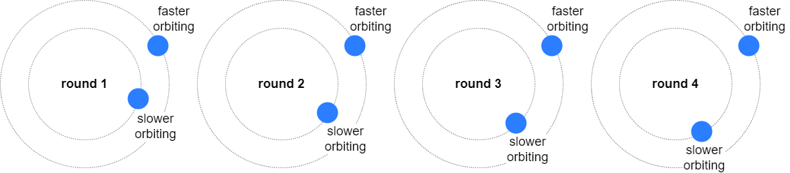
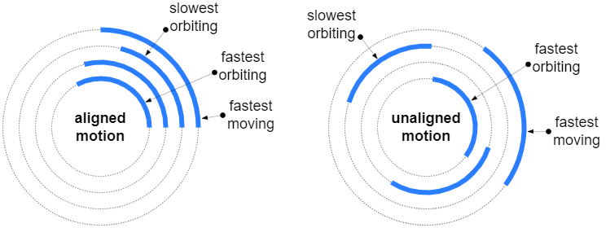

&nbsp;
### About

Speed is the time rate at which a numerical parameter changes. This parameter could be position in space, color, angle of orientation, level of transparency, etc. When an object orbits another objects, its speed can be defined in two ways: distance per time or angle per time. The later is called *angular speed* and it is the magnitute of the [orbital angular velocity](https://en.wikipedia.org/wiki/Angular_velocity).

The **Race balls** application develops your sense and reasoning about angular speed. Several balls move long circular tracks at different angular speeds. The challenge is to identify the ball with highest and lowest angular speeds.

Click on the image to start the application.

Alternatively, here are versions in [English](race-balls.html?lang=en), [Bulgarian](race-balls.html?lang=bg) and [Japanese](race-balls.html?lang=jp).

### How to play

When the application is started it shows the back side of the tracks. When the tracks are flipped over, the balls are seen. Selected tracks are black with glowing balls. The level of difficulty determins how different are the speeds, but also &ndash; the number and the orientation of tracks. The goal is to reach score 100. 

- **Starting**: Click anywhere on the back of the tracks.
- **Playing**:  Click on a track to select or unselect it.
- **Ending**: Click on the center big black ball to end the challenge.

Here are a few hints: The tracks can be toggles as many times as it is needed. It might be easier first to find the slowest ball, than to look for the fastest. You can easiely compare two balls by selecting only them &ndash; this will make them stand out. Sometimes when angular speeds are too close, it might be good to observe motion for several rounds until it is clear which ball is slower or faster.

The whole construction of tracks can be rotated if you need a better view point. Be careful as the visual appearance of speed does not always correspont to angular speed. It may happen that a faster moving ball has lower angular speed than slower moving ball. This is, find the balls that orbit fastest and slowest, not the balls that move fastest and slowest.

### Integration with LMS

This application is provided as [SCORM](https://scorm.com/scorm-explained/one-minute-scorm-overview/) (Sharable Content Object Reference Model) module. It can be used with any [LMS](https://en.wikipedia.org/wiki/Learning_management_system) (Learning Management System) that supports version SCORM 1.2. SCORM modules are delivered as ZIP archive.

[ [Download ZIP](../../bin/race-balls.zip) ]

Follow the instruction of your LMS on how to install a SCORM module. Usually the ZIP is uploaded and a few additional settings are set.

When run from a LMS, the application reads these data:
- `cmi.core.student_name` &ndash; a string with the student's name

When run from a LMS, the application sends back these data:

- `cmi.core.score.raw` &ndash; a number from 0 to 100 for the overall score
- `cmi.core.score.min` &ndash; 0
- `cmi.core.score.max` &ndash; 100
- `cmi.core.lesson_status` &ndash; `'completed'` or `'incomplete'`

### Data policy

The application itself does not create or use [HTTP cookies](https://developer.mozilla.org/en-US/docs/Web/HTTP/Cookies), [web beacons](https://en.wikipedia.org/wiki/Web_beacon), [spy pixels](https://en.wikipedia.org/wiki/Spy_pixel) or any other tracking technology. Besides SCORM-related data, described in section [Integration with LMS](#integration-with-lms), the application creates a local storage entry called `'sound'` with values `'on'`, `'off'` or `'fx'`. This entry is used to record user's sound preference and it is not sent to the server.

When the application is run from a LMS, the LMS may utilize its own data policy, which is beyond the scope and the control of this application.

### Disclaimer

This application might cause a trance state (or a light form of hypnosis) in users that are sensitive to repetative motion, especially circular motion.

### Credits

This application uses a background music from [SoundCloud](https://soundcloud.com):

- "[Sunlight](https://soundcloud.com/roa_music1031/sunlight)" by [Roa](https://soundcloud.com/roa_music1031) ([Roa Music](https://roa-music.com/)) licensed under [CC BY 3.0 License](https://creativecommons.org/licenses/by/3.0/),

and sound effects from [Mixkit](https://mixkit.co/):

- "[Game quick warning notification](https://mixkit.co/free-sound-effects/click/)" licensed under [Mixkit Sound Effects Free License](https://mixkit.co/license/#sfxFree),
- "[Quick win video game notification](https://mixkit.co/free-sound-effects/click/)" licensed under [Mixkit Sound Effects Free License](https://mixkit.co/license/#sfxFree).

	
<small>{{site.time | date: "%B, %Y"}}</small>